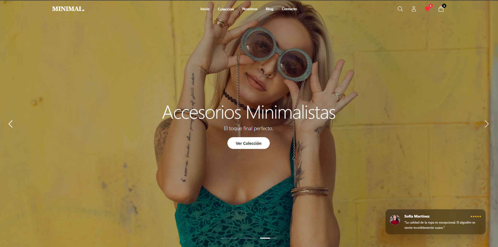

# MinimalStore E-commerce 🛍️

Una aplicación de comercio electrónico moderna, minimalista y totalmente responsiva construida con el ecosistema de React. Este proyecto demuestra una arquitectura escalable, gestión de estado global y una experiencia de usuario fluida con animaciones avanzadas.




## 🚀 Tecnologías Utilizadas

- **Core:** React 18, TypeScript, Vite
- **Estilos:** Tailwind CSS
- **Estado Global:** Zustand (con persistencia en LocalStorage)
- **Animaciones:** Framer Motion
- **Enrutamiento:** React Router DOM v6
- **SEO:** React Helmet Async
- **Testing:** Vitest

## ✨ Características Principales

- **Carrito de Compras:** Lógica completa de añadir, eliminar y actualizar cantidades con persistencia de datos.
- **Lista de Deseos (Wishlist):** Guarda tus productos favoritos.
- **Filtrado y Búsqueda:** Filtrado por categoría, precio, color, talla y búsqueda en tiempo real.
- **UI/UX Avanzada:**
  - Transiciones de página suaves.
  - Animaciones con Framer Motion (Scroll reveal, micro-interacciones).
  - Modales de "Vista Rápida".
  - Notificaciones tipo "Toast".
  - Skeleton loading para simular carga de datos.
- **Gestión de Cuenta:** Simulación de autenticación, historial de pedidos y perfil de usuario.
- **Blog:** Sección de artículos con cálculo de tiempo de lectura.
- **Checkout Simulado:** Formulario de pago con validaciones, autocompletado de dirección por CP y generación de resumen de pedido imprimible.
- **Diseño Responsivo:** Optimizado para móviles, tablets y escritorio.

## 🛠️ Instalación y Uso

1. **Clonar el repositorio**
   ```bash
   git clone https://github.com/tu-usuario/minimal-store.git
   cd minimal-store
   ```

2. **Instalar dependencias**
   ```bash
   npm install
   ```

3. **Configurar Variables de Entorno**
   
   Copia el archivo de ejemplo y configura tus variables:
   ```bash
   cp .env.example .env
   ```
   Asegúrate de que `.env` contenga:
   ```env
   VITE_SITE_URL=http://localhost:5173
   VITE_ZIP_API_URL=https://api.zippopotam.us
   ```

4. **Iniciar servidor de desarrollo**
   ```bash
   npm run dev
   ```

5. **Construir para producción**
   ```bash
   npm run build
   ```

## 📂 Estructura del Proyecto

```
src/
├── components/   # Componentes UI reutilizables (Botones, Inputs, Layouts)
├── features/     # Componentes específicos de dominio (Carrito, Productos)
├── hooks/        # Custom Hooks (useScroll, etc.)
├── pages/        # Vistas principales de la aplicación
├── store/        # Estado global con Zustand
├── scripts/      # Scripts de utilidad (generación de sitemap)
├── types/        # Definiciones de tipos TypeScript
└── utils/        # Utilidades y helpers
```

## 🧪 Testing

El proyecto incluye pruebas unitarias para la lógica crítica del negocio (ej. carrito de compras).

```bash
npm run test
```

## 📝 Notas

Este es un proyecto de demostración. Los pagos no son reales y los datos de los productos son estáticos para fines de exhibición.

---
Desarrollado por  **ValBitStudio**